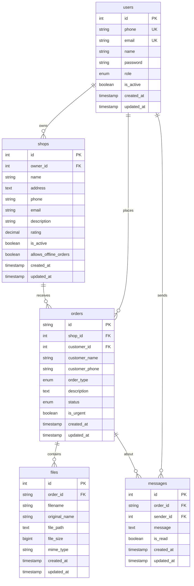
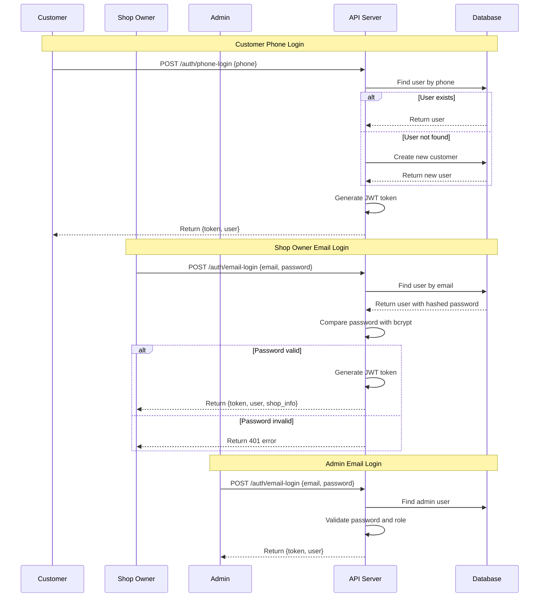
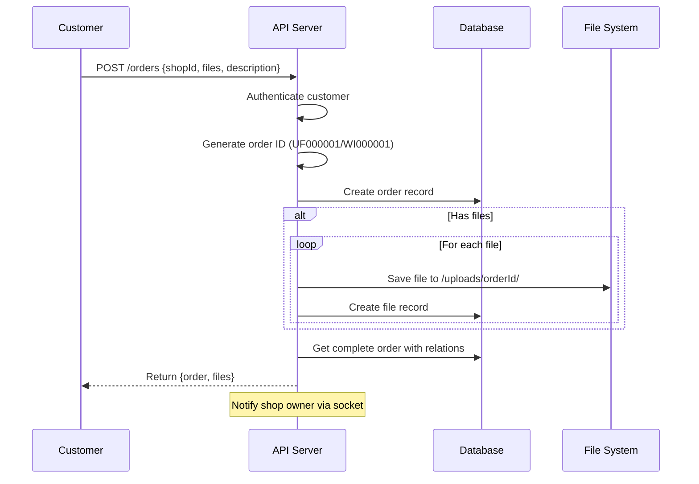
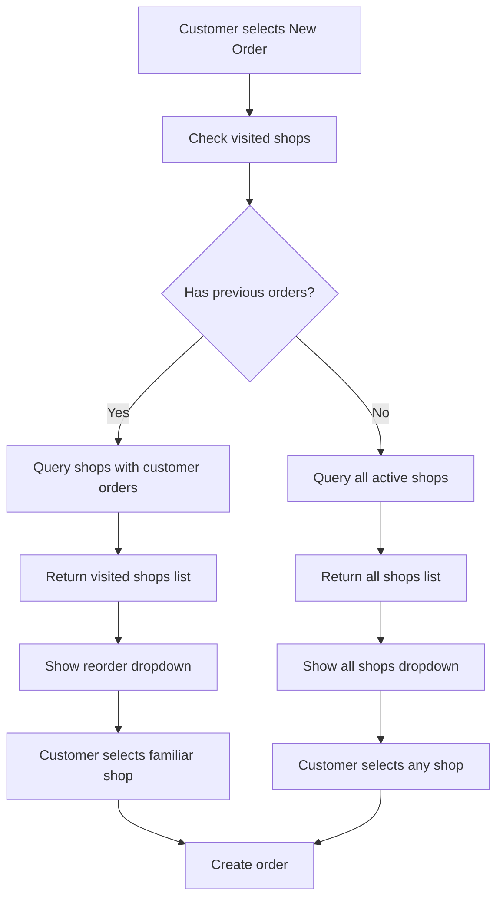
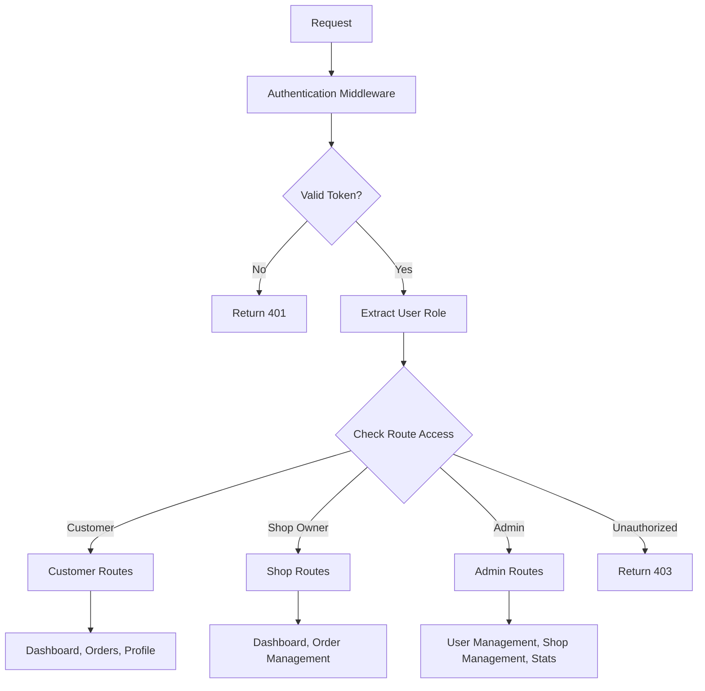

# PrintEasy Backend Architecture

## Database Schema


## API Routes Structure
```mermaid
graph TD
    A[API Base URL] --> B[/auth]
    A --> C[/shops]
    A --> D[/orders]
    A --> E[/files]
    A --> F[/chat]
    A --> G[/admin]

    B --> B1[POST /phone-login]
    B --> B2[POST /email-login]
    B --> B3[PATCH /update-profile]
    B --> B4[GET /me]
    B --> B5[POST /logout]

    C --> C1[GET / - All shops]
    C --> C2[GET /visited - Customer's visited shops]
    C --> C3[GET /:shopId - Shop details]

    D --> D1[POST / - Create order]
    D --> D2[GET /customer - Customer orders]
    D --> D3[GET /shop - Shop orders]
    D --> D4[PATCH /:orderId/status]
    D --> D5[PATCH /:orderId/urgency]

    E --> E1[POST /upload/:orderId]
    E --> E2[GET /order/:orderId]
    E --> E3[GET /download/:fileId]
    E --> E4[DELETE /:fileId]

    F --> F1[GET /order/:orderId]
    F --> F2[POST /send]
    F --> F3[GET /unread-count]

    G --> G1[GET /stats]
    G --> G2[GET /users]
    G --> G3[GET /shops]
    G --> G4[POST /shops]
    G --> G5[PATCH /users/:userId/status]
    G --> G6[DELETE /users/:userId]
```

## Authentication Flow


## Order Creation Flow


## Business Logic: Visited Shops


## Role-Based Access Control

